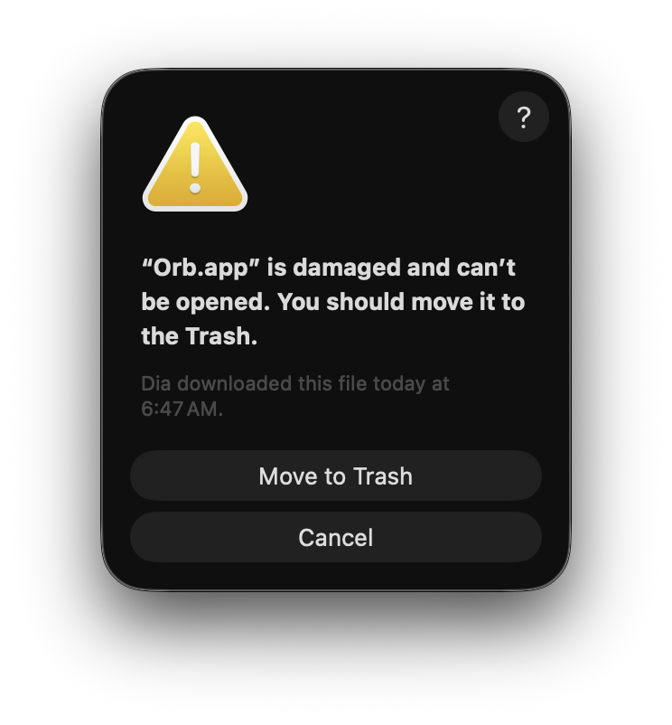

# Orb

**Ambient GitHub awareness for AI-native development orchestration.**

Orb lives in your menu bar and watches your GitHub PRs. It categorizes them by what needs your attention, shows CI status and review state at a glance, and emits structured events that AI agents can act on. Review feedback lands, your agent addresses it. CI fails, your agent debugs it. PR approved, it merges automatically. You stay in flow.

### Why not just use GitHub webhooks / Actions / notifications?

| Approach | Limitation |
|----------|-----------|
| **Webhooks** | Require a server you host, per-repo setup, fire for all activity (not just yours) |
| **Actions triggers** | Run in the cloud, can't trigger local AI agents, per-repo workflow files |
| **Notifications API** | Unstructured feed, no diffing, no priority categorization |

Orb is **user-centric and local-first**: one view across all repos, events delivered locally where your agents run, smart priority buckets, granular state diffing, zero infrastructure.

---

## Download

Head to the [Releases](https://github.com/shivanshukumar/orb-releases/releases) page and download the installer for your platform:

| Platform | File | Notes |
|----------|------|-------|
| macOS (Apple Silicon) | `Orb_x.x.x_Apple_Silicon.dmg` | M1 and later |
| macOS (Intel) | `Orb_x.x.x_Intel.dmg` | 2020 and earlier Macs |
| Linux (x86_64) | `orb_x.x.x_amd64.deb` | `.deb` for Debian-based distros (see below) |
| Linux (x86_64) | `orb_x.x.x_amd64.AppImage` | Runs on any x86_64 Linux distro |
| Linux (ARM64) | `orb_x.x.x_arm64.deb` | `.deb` for ARM64 Debian-based distros |
| Linux (ARM64) | `orb_x.x.x_arm64.AppImage` | Raspberry Pi, ARM servers, Docker on Apple Silicon |

**Linux `.deb` compatibility:** Ubuntu 22.04+, Debian 12+, Linux Mint 21+, Pop!_OS 22.04+, elementary OS 7+, Raspberry Pi OS (ARM64), and other Debian-based distros.

**Linux `.AppImage` compatibility:** Runs on any Linux distro — Fedora, Arch, Manjaro, openSUSE, etc. No installation needed, just make it executable and run.

**Linux tray icon note:** Works natively on KDE, XFCE, MATE, Cinnamon, and most non-GNOME desktops. On GNOME (Ubuntu's default), install the [AppIndicator extension](https://extensions.gnome.org/extension/615/appindicator-support/) to see the tray icon — takes 30 seconds.

**Headless use:** No desktop required. Run Orb as a background process and consume events via the JSONL stream or Unix socket — pipe them into scripts and AI agents without a tray icon.

---

## Setup

### 1. Install the GitHub CLI

Orb uses the `gh` CLI to talk to GitHub. You need it installed and authenticated.

**macOS:**
```bash
brew install gh
```

**Linux (Debian/Ubuntu):**
```bash
sudo apt install gh
```

Or download from https://cli.github.com/

### 2. Authenticate with GitHub

```bash
gh auth login
```

Follow the prompts. Choose HTTPS and authenticate via browser. Orb needs this to read your PRs — it never touches your credentials directly.

To verify it worked:
```bash
gh auth status
```

You should see "Logged in to github.com."

### 3. Install Orb

- **macOS:** Open the `.dmg`, drag Orb to Applications.

  > **⚠️ macOS will block the app on first launch.** Orb is not notarized by Apple. You'll see this warning — it does NOT mean the app is damaged. This is normal for open-source apps distributed outside the Mac App Store.

  <p align="center"></p>

  **Click Cancel**, then run this one-time command to allow Orb to launch:
  ```bash
  xattr -dr com.apple.quarantine '/Applications/Orb.app'
  ```

- **Linux:** Install the `.deb` with `sudo dpkg -i orb_*.deb`, or run the `.AppImage` directly.

### 4. Launch

Orb appears as an icon in your menu bar (macOS) or system tray (Linux). Click it to see your PRs. That's it.

On first launch, Orb will poll GitHub and populate your PR list. This takes a few seconds.

---

## What you get

**The popup** — click the tray icon to see all your PRs organized by what needs your attention. Each PR shows CI status, review state, author avatar, and age. Sections are collapsible and reorderable. Right-click any PR for quick actions: approve, merge (with strategy picker), request changes, or copy link.

**7 PR sections:**

| Section | What it means |
|---------|---------------|
| Needs Your Review | Someone requested your review on this PR |
| Action Needed | Your PR needs attention — changes requested, CI failing, or unresolved comments |
| Waiting for Reviewers | Your PR is open and waiting for reviewers |
| Waiting for Author | You reviewed this PR and the author hasn't acted yet |
| Approved | Your PR is approved and ready to merge |
| Drafts | Your draft PRs |
| Recently Merged | PRs you authored or reviewed that merged recently |

**Events for AI agents** — Orb emits structured events (JSONL log, Unix socket, shell hooks) on every PR state change. Wire up your AI agents to respond automatically. See the [agent integration guide](#agent-integration) below.

**Settings** — poll interval, notification preferences, section visibility and order, badge configuration, event hooks, repo filtering. All accessible from the gear icon.

---

## Agent integration

Orb fires events whenever a PR changes state. You can consume them three ways:

**Shell hooks** — configure commands in Settings that run when specific events fire:

```json
{
  "on_ci_status_change": "cd ~/code/$ORB_REPO && claude -p 'CI failed on PR #$ORB_PR_NUMBER. Fix it.'",
  "on_pr_approved": "gh pr merge $ORB_PR_NUMBER --squash --auto --repo $ORB_REPO",
  "on_new_pr": "claude -p 'Do a first-pass review of PR #$ORB_PR_NUMBER in $ORB_REPO'"
}
```

**JSONL log** — every event is appended to a local file. Pipe it into anything:

```bash
# macOS
tail -f ~/Library/Application\ Support/orb/events.jsonl | jq 'select(.event == "bucket_change")'

# Linux
tail -f ~/.local/share/orb/events.jsonl | jq 'select(.event == "bucket_change")'

```

**Unix socket** (macOS/Linux) — real-time streaming with optional event filtering:

```bash
# macOS
echo '{"subscribe": {"events": ["pr_approved", "ci_status_change"]}}' \
  | socat - UNIX-CONNECT:"$HOME/Library/Application Support/orb/orb.sock"

# Linux
echo '{"subscribe": {"events": ["pr_approved", "ci_status_change"]}}' \
  | socat - UNIX-CONNECT:"$HOME/.local/share/orb/orb.sock"
```

### Event types

**Primitive events** — each covers one state dimension:

| Event | When it fires |
|---|---|
| `new_pr` | A PR appears in your view for the first time |
| `pr_removed` | A PR disappears from your view |
| `pr_updated` | PR metadata changed (title, description, labels, base branch) |
| `bucket_change` | A PR moves from one section to another |
| `ci_status_change` | CI status flips (e.g. pending to failure) |
| `commits_pushed` | New commits land on the PR branch |
| `merge_status_change` | PR mergeability changed (e.g. clean to conflicting) |
| `review_received` | A new review is submitted on your PR |
| `review_re_requested` | Review re-requested from a reviewer |
| `comment_added` | New comments on a PR |
| `poll_complete` | A polling cycle finished |
| `action_taken` | You used a quick action from the popup |

**Convenience events** — emitted alongside primitives for common workflows:

| Event | Equivalent to |
|---|---|
| `pr_approved` | `bucket_change` where new section is Approved |
| `pr_merged` | `bucket_change` where new section is Recently Merged |
| `attention_needed` | Summary of all PRs needing your action |

### Hook environment variables

| Variable | Description |
|---|---|
| `ORB_EVENT` | Event name |
| `ORB_PR_NUMBER` | PR number |
| `ORB_PR_TITLE` | PR title |
| `ORB_PR_URL` | PR URL |
| `ORB_REPO` | Repository (owner/name) |
| `ORB_PR_AUTHOR` | PR author |
| `ORB_HEAD_REF` | Source branch |
| `ORB_BUCKET` | Current section ID |
| `ORB_EVENT_JSON` | Path to full event payload (use with `jq`) |

---

## Settings reference

| Setting | Default | Description |
|---|---|---|
| Poll interval | 45 seconds | How often Orb checks GitHub (minimum 15s) |
| Merged PR window | 7 days | How far back to show recently merged PRs |
| Max PR age | No limit | Hide PRs older than N days |
| Blocked repos | None | Repos to exclude (new repos visible by default) |
| Badge sections | Needs Your Review | Which sections count toward the tray badge |
| Notifications | On | Desktop notifications for state changes |
| Events | On | Enable the event system |
| Hook timeout | 30 seconds | Kill hook commands that exceed this |

---

## Changelog

### v0.1.0

Initial release.

- Command center popup with quick actions (approve, merge with strategy picker, request changes, copy link)
- 7 PR sections with smart categorization (Action Needed detects changes requested, CI failing, unresolved comments)
- Event system with 12 primitive events + 3 convenience wrappers, delivered via JSONL log, Unix socket, and shell hooks
- Configurable settings: poll interval, notifications, section visibility/order/badge, repo filtering, event hooks
- Soft dark theme with light mode support
- macOS and Linux support

---

## Troubleshooting

**Orb shows an error icon (X) in the tray**
- Run `gh auth status` to check if the GitHub CLI is authenticated
- Open Settings and check the GitHub CLI status section
- Click "Try Again" after fixing the issue

**"Orb.app is damaged" / "Unidentified developer" on macOS**
```bash
xattr -dr com.apple.quarantine '/Applications/Orb.app'
```
See [Install step 3](#3-install-orb) for details.

**No PRs showing up**
- Make sure you have open PRs or recent review requests on GitHub
- Check that the repos aren't in your blocked list (Settings)
- Wait for one poll cycle (check the timestamp in the popup header)

**Notifications keep repeating**
- Orb has a 30-minute cooldown per PR per section. If you're still seeing repeats, file an issue.

---

## Feedback and issues

This is an early release. If you run into problems or have feature requests, please open an issue on this repository.

---

## Disclaimer

Orb is an independent project and is not affiliated with, endorsed by, or supported by GitHub, Anthropic, or any other company. It is provided as-is with no warranty. By using Orb, you accept responsibility for its operation in your environment. See the full [LICENSE](LICENSE) for details.
